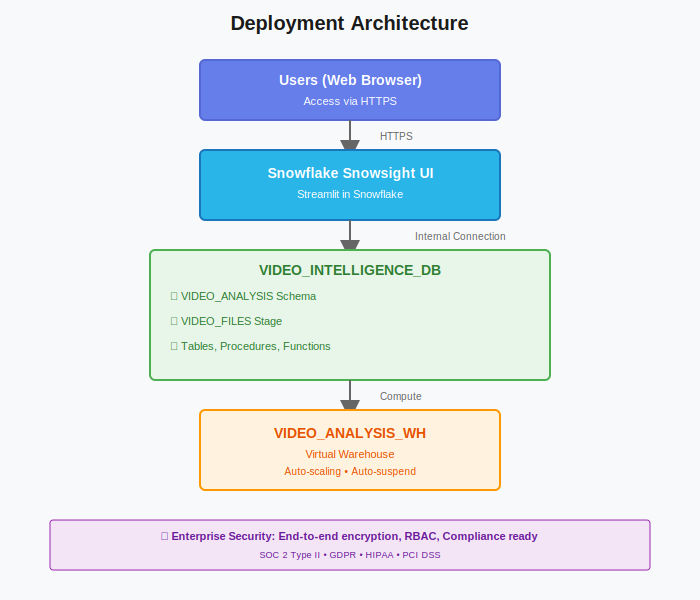

# Deployment Guide - Snowflake Video Intelligence Demo

## Table of Contents
1. [Deployment Overview](#deployment-overview)
2. [Pre-Deployment Checklist](#pre-deployment-checklist)
3. [Deployment Steps](#deployment-steps)
4. [Post-Deployment Configuration](#post-deployment-configuration)
5. [Production Best Practices](#production-best-practices)
6. [Scaling and Performance](#scaling-and-performance)
7. [Monitoring and Maintenance](#monitoring-and-maintenance)

---

## Deployment Overview

This guide covers deploying the Snowflake Video Intelligence Demo to a production Snowflake environment.

### Deployment Architecture



### Deployment Timeline

| Phase | Duration | Description |
|-------|----------|-------------|
| **Preparation** | 30 min | Review requirements, gather credentials |
| **Database Setup** | 5 min | Run SQL setup scripts |
| **App Deployment** | 5 min | Deploy Streamlit app |
| **Configuration** | 15 min | Set permissions, resource monitors |
| **Testing** | 15 min | Verify functionality |
| **Go-Live** | - | Enable user access |
| **Total** | ~70 min | End-to-end deployment |

---

## Pre-Deployment Checklist

### Account Requirements

- [ ] Snowflake account provisioned
- [ ] ACCOUNTADMIN or equivalent role access
- [ ] Cortex AI enabled in your region (verify with Snowflake)
- [ ] Streamlit in Snowflake available
- [ ] Sufficient credit budget allocated

### Resource Planning

- [ ] Warehouse size determined (recommend LARGE for production)
- [ ] Storage quota allocated for video files
- [ ] Resource monitor configured
- [ ] Network policies defined (if required)
- [ ] User roles and permissions planned

### Security & Compliance

- [ ] Data classification reviewed
- [ ] Compliance requirements identified (GDPR, HIPAA, etc.)
- [ ] Network access policies defined
- [ ] Audit logging requirements understood
- [ ] Data retention policies established

### Team Readiness

- [ ] Database administrator identified
- [ ] Application administrator assigned
- [ ] End users identified
- [ ] Training materials prepared
- [ ] Support process defined

---

## Deployment Steps

### Step 1: Environment Preparation

#### 1.1 Connect to Snowflake

```sql
-- Login to Snowflake Snowsight
-- URL format: https://<account_identifier>.snowflakecomputing.com

-- Switch to ACCOUNTADMIN role
USE ROLE ACCOUNTADMIN;

-- Verify account information
SELECT CURRENT_ACCOUNT(), CURRENT_REGION();

-- Verify Cortex availability
SELECT SYSTEM$FEATURE_ENABLED('CORTEX') AS CORTEX_ENABLED;
```

#### 1.2 Create Resource Monitor (Recommended)

```sql
-- Create resource monitor for cost control
CREATE RESOURCE MONITOR VIDEO_INTELLIGENCE_MONITOR
  WITH 
    CREDIT_QUOTA = 500  -- Adjust based on budget
    FREQUENCY = MONTHLY
    START_TIMESTAMP = IMMEDIATELY
    TRIGGERS 
      ON 75 PERCENT DO NOTIFY
      ON 90 PERCENT DO SUSPEND
      ON 100 PERCENT DO SUSPEND_IMMEDIATE;
```

### Step 2: Database and Schema Setup

#### 2.1 Run Initial Setup Script

Execute the contents of `setup/01_initial_setup.sql`:

```sql
-- Create database, schema, warehouse, and stage
-- See setup/01_initial_setup.sql for full script
```

**Expected Output:**
```
Database: VIDEO_INTELLIGENCE_DB created
Schema: VIDEO_ANALYSIS created
Warehouse: VIDEO_ANALYSIS_WH created
Stage: VIDEO_FILES created
```

#### 2.2 Assign Resource Monitor

```sql
-- Assign resource monitor to warehouse
ALTER WAREHOUSE VIDEO_ANALYSIS_WH 
  SET RESOURCE_MONITOR = VIDEO_INTELLIGENCE_MONITOR;
```

### Step 3: Create Database Objects

#### 3.1 Create Tables

Execute the contents of `setup/02_create_tables.sql`:

```sql
-- Create VIDEO_METADATA, VIDEO_ANALYSIS_RESULTS, VIDEO_QUERIES
-- See setup/02_create_tables.sql for full script
```

**Verification:**
```sql
-- Verify tables exist
SHOW TABLES IN VIDEO_INTELLIGENCE_DB.VIDEO_ANALYSIS;

-- Expected: 3 tables
```

#### 3.2 Create Functions and Procedures

Execute the contents of `setup/03_create_functions.sql`:

```sql
-- Create stored procedures and views
-- See setup/03_create_functions.sql for full script
```

**Verification:**
```sql
-- Verify procedures
SHOW PROCEDURES IN VIDEO_INTELLIGENCE_DB.VIDEO_ANALYSIS;

-- Verify views
SHOW VIEWS IN VIDEO_INTELLIGENCE_DB.VIDEO_ANALYSIS;
```

### Step 4: Deploy Streamlit Application

#### 4.1 Create Streamlit App

1. Navigate to **Streamlit** in Snowsight
2. Click **+ Streamlit App**
3. Configure:
   - **App name:** `VIDEO_INTELLIGENCE_APP`
   - **Warehouse:** `VIDEO_ANALYSIS_WH`
   - **Database:** `VIDEO_INTELLIGENCE_DB`
   - **Schema:** `VIDEO_ANALYSIS`

#### 4.2 Upload Application Code

1. Delete default code in editor
2. Copy entire contents of `streamlit_app.py`
3. Paste into Streamlit editor
4. Click **Run**

**Verification:**
- App should load within 30 seconds
- All 4 tabs should be visible
- No Python errors in console

### Step 5: Configure Access Control

#### 5.1 Create Application Role

```sql
-- Create dedicated role for app users
CREATE ROLE IF NOT EXISTS VIDEO_INTELLIGENCE_USER;

-- Grant database and schema access
GRANT USAGE ON DATABASE VIDEO_INTELLIGENCE_DB TO ROLE VIDEO_INTELLIGENCE_USER;
GRANT USAGE ON SCHEMA VIDEO_INTELLIGENCE_DB.VIDEO_ANALYSIS TO ROLE VIDEO_INTELLIGENCE_USER;

-- Grant warehouse access
GRANT USAGE ON WAREHOUSE VIDEO_ANALYSIS_WH TO ROLE VIDEO_INTELLIGENCE_USER;

-- Grant table permissions
GRANT SELECT, INSERT ON TABLE VIDEO_INTELLIGENCE_DB.VIDEO_ANALYSIS.VIDEO_METADATA 
  TO ROLE VIDEO_INTELLIGENCE_USER;
GRANT SELECT, INSERT ON TABLE VIDEO_INTELLIGENCE_DB.VIDEO_ANALYSIS.VIDEO_QUERIES 
  TO ROLE VIDEO_INTELLIGENCE_USER;
GRANT SELECT, INSERT ON TABLE VIDEO_INTELLIGENCE_DB.VIDEO_ANALYSIS.VIDEO_ANALYSIS_RESULTS 
  TO ROLE VIDEO_INTELLIGENCE_USER;

-- Grant stage permissions
GRANT READ, WRITE ON STAGE VIDEO_INTELLIGENCE_DB.VIDEO_ANALYSIS.VIDEO_FILES 
  TO ROLE VIDEO_INTELLIGENCE_USER;

-- Grant procedure permissions
GRANT USAGE ON PROCEDURE VIDEO_INTELLIGENCE_DB.VIDEO_ANALYSIS.REGISTER_VIDEO(VARCHAR, VARCHAR, NUMBER) 
  TO ROLE VIDEO_INTELLIGENCE_USER;
GRANT USAGE ON PROCEDURE VIDEO_INTELLIGENCE_DB.VIDEO_ANALYSIS.LOG_VIDEO_QUERY(VARCHAR, TEXT, TEXT, VARCHAR, NUMBER) 
  TO ROLE VIDEO_INTELLIGENCE_USER;

-- Grant view permissions
GRANT SELECT ON VIEW VIDEO_INTELLIGENCE_DB.VIDEO_ANALYSIS.VIDEO_SUMMARY 
  TO ROLE VIDEO_INTELLIGENCE_USER;
```

#### 5.2 Assign Role to Users

```sql
-- Grant role to specific users
GRANT ROLE VIDEO_INTELLIGENCE_USER TO USER <username>;

-- Or grant to an existing role
GRANT ROLE VIDEO_INTELLIGENCE_USER TO ROLE <existing_role>;
```

#### 5.3 Grant Streamlit App Access

```sql
-- Grant access to the Streamlit app
GRANT USAGE ON STREAMLIT VIDEO_INTELLIGENCE_DB.VIDEO_ANALYSIS.VIDEO_INTELLIGENCE_APP 
  TO ROLE VIDEO_INTELLIGENCE_USER;
```

---

## Post-Deployment Configuration

### Network Policies (Optional but Recommended)

```sql
-- Create network policy to restrict access by IP
CREATE NETWORK POLICY VIDEO_INTELLIGENCE_NETWORK_POLICY
  ALLOWED_IP_LIST = (
    '192.168.1.0/24',  -- Office network
    '10.0.0.0/8'       -- VPN range
  )
  BLOCKED_IP_LIST = ()
  COMMENT = 'Network policy for Video Intelligence app';

-- Apply to users with the role
-- Note: Apply carefully to avoid locking yourself out
-- ALTER USER <username> SET NETWORK_POLICY = VIDEO_INTELLIGENCE_NETWORK_POLICY;
```

### Enable Query Tags

```sql
-- Enable query tagging for better monitoring
ALTER SESSION SET QUERY_TAG = 'VIDEO_INTELLIGENCE_APP';
```

### Configure Time Travel

```sql
-- Set data retention for compliance
ALTER TABLE VIDEO_INTELLIGENCE_DB.VIDEO_ANALYSIS.VIDEO_METADATA 
  SET DATA_RETENTION_TIME_IN_DAYS = 7;

ALTER TABLE VIDEO_INTELLIGENCE_DB.VIDEO_ANALYSIS.VIDEO_QUERIES 
  SET DATA_RETENTION_TIME_IN_DAYS = 30;
```

---

## Production Best Practices

### 1. Security

#### Multi-Factor Authentication
```sql
-- Enable MFA for all users (run as ACCOUNTADMIN)
ALTER ACCOUNT SET MFA_ENROLLMENT = 'REQUIRED';
```

#### Password Policies
```sql
-- Create strong password policy
CREATE PASSWORD POLICY VIDEO_INTELLIGENCE_PASSWORD_POLICY
  PASSWORD_MIN_LENGTH = 12
  PASSWORD_MAX_LENGTH = 64
  PASSWORD_MIN_UPPER_CASE_CHARS = 1
  PASSWORD_MIN_LOWER_CASE_CHARS = 1
  PASSWORD_MIN_NUMERIC_CHARS = 1
  PASSWORD_MIN_SPECIAL_CHARS = 1
  PASSWORD_MAX_AGE_DAYS = 90;
```

### 2. Performance Optimization

#### Enable Result Caching
```sql
-- Enable result caching (improves performance for repeated queries)
ALTER SESSION SET USE_CACHED_RESULT = TRUE;
```

#### Configure Statement Timeout
```sql
-- Set timeout to prevent runaway queries
ALTER SESSION SET STATEMENT_TIMEOUT_IN_SECONDS = 300;
```

#### Warehouse Auto-Scaling
```sql
-- Enable multi-cluster warehouse for high concurrency
ALTER WAREHOUSE VIDEO_ANALYSIS_WH SET
  MIN_CLUSTER_COUNT = 1
  MAX_CLUSTER_COUNT = 3
  SCALING_POLICY = 'STANDARD';
```

### 3. Cost Management

#### Set Statement Queuing
```sql
-- Limit concurrent queries to control costs
ALTER WAREHOUSE VIDEO_ANALYSIS_WH SET
  MAX_CONCURRENCY_LEVEL = 8;
```

#### Configure Auto-Suspend
```sql
-- Aggressive auto-suspend for cost savings
ALTER WAREHOUSE VIDEO_ANALYSIS_WH SET
  AUTO_SUSPEND = 60;  -- 60 seconds
```

### 4. Monitoring Setup

#### Create Monitoring View
```sql
CREATE OR REPLACE VIEW MONITORING_DASHBOARD AS
SELECT 
    DATE_TRUNC('HOUR', START_TIME) AS HOUR,
    COUNT(*) AS QUERY_COUNT,
    AVG(TOTAL_ELAPSED_TIME) AS AVG_DURATION_MS,
    SUM(CREDITS_USED) AS TOTAL_CREDITS
FROM SNOWFLAKE.ACCOUNT_USAGE.QUERY_HISTORY
WHERE WAREHOUSE_NAME = 'VIDEO_ANALYSIS_WH'
  AND START_TIME >= DATEADD(DAY, -7, CURRENT_TIMESTAMP())
GROUP BY HOUR
ORDER BY HOUR DESC;
```

---

## Scaling and Performance

### Horizontal Scaling (More Users)

```sql
-- Increase max clusters for more concurrent users
ALTER WAREHOUSE VIDEO_ANALYSIS_WH SET
  MAX_CLUSTER_COUNT = 5;
```

### Vertical Scaling (Faster Processing)

```sql
-- Increase warehouse size for faster queries
ALTER WAREHOUSE VIDEO_ANALYSIS_WH SET
  WAREHOUSE_SIZE = 'X-LARGE';
```

### Performance Tuning Recommendations

| Concurrent Users | Recommended Size | Cluster Count |
|-----------------|------------------|---------------|
| 1-10 | SMALL | 1 |
| 10-25 | MEDIUM | 1-2 |
| 25-50 | LARGE | 1-2 |
| 50-100 | LARGE | 2-3 |
| 100-200 | X-LARGE | 2-4 |
| 200+ | X-LARGE | 3-5 |

---

## Monitoring and Maintenance

### Daily Monitoring Tasks

```sql
-- Check warehouse utilization
SELECT 
    WAREHOUSE_NAME,
    AVG(AVG_RUNNING) AS AVG_RUNNING_QUERIES,
    MAX(AVG_RUNNING) AS MAX_RUNNING_QUERIES
FROM SNOWFLAKE.ACCOUNT_USAGE.WAREHOUSE_LOAD_HISTORY
WHERE WAREHOUSE_NAME = 'VIDEO_ANALYSIS_WH'
  AND START_TIME >= DATEADD(DAY, -1, CURRENT_TIMESTAMP())
GROUP BY WAREHOUSE_NAME;

-- Check credit consumption
SELECT 
    SUM(CREDITS_USED) AS DAILY_CREDITS
FROM SNOWFLAKE.ACCOUNT_USAGE.WAREHOUSE_METERING_HISTORY
WHERE WAREHOUSE_NAME = 'VIDEO_ANALYSIS_WH'
  AND START_TIME >= DATEADD(DAY, -1, CURRENT_TIMESTAMP());
```

### Weekly Maintenance Tasks

```sql
-- Analyze table statistics
ANALYZE TABLE VIDEO_INTELLIGENCE_DB.VIDEO_ANALYSIS.VIDEO_METADATA;
ANALYZE TABLE VIDEO_INTELLIGENCE_DB.VIDEO_ANALYSIS.VIDEO_QUERIES;

-- Check storage usage
SELECT 
    COUNT(*) AS VIDEO_COUNT,
    SUM(FILE_SIZE_BYTES) / (1024*1024*1024) AS TOTAL_SIZE_GB
FROM VIDEO_INTELLIGENCE_DB.VIDEO_ANALYSIS.VIDEO_METADATA;
```

### Monthly Maintenance Tasks

```sql
-- Archive old query history (older than 90 days)
CREATE TABLE IF NOT EXISTS VIDEO_QUERIES_ARCHIVE LIKE VIDEO_QUERIES;

INSERT INTO VIDEO_QUERIES_ARCHIVE
SELECT * FROM VIDEO_QUERIES
WHERE CREATED_AT < DATEADD(DAY, -90, CURRENT_TIMESTAMP());

DELETE FROM VIDEO_QUERIES
WHERE CREATED_AT < DATEADD(DAY, -90, CURRENT_TIMESTAMP());

-- Review resource monitor usage
SHOW RESOURCE MONITORS;
```

---

## Rollback Plan

In case of issues during deployment:

```sql
-- Drop all objects (CAUTION: This deletes all data)
DROP DATABASE IF EXISTS VIDEO_INTELLIGENCE_DB CASCADE;
DROP WAREHOUSE IF EXISTS VIDEO_ANALYSIS_WH;
DROP RESOURCE MONITOR IF EXISTS VIDEO_INTELLIGENCE_MONITOR;

-- Drop Streamlit app
DROP STREAMLIT IF EXISTS VIDEO_INTELLIGENCE_DB.VIDEO_ANALYSIS.VIDEO_INTELLIGENCE_APP;
```

---

## Production Deployment Checklist

Final checklist before going live:

- [ ] All SQL scripts executed successfully
- [ ] Streamlit app loads without errors
- [ ] Test video uploaded successfully
- [ ] Sample query returns valid response
- [ ] User roles and permissions configured
- [ ] Resource monitor in place
- [ ] Network policies applied (if required)
- [ ] Monitoring dashboard accessible
- [ ] Backup and recovery procedures documented
- [ ] Users trained on the application
- [ ] Support process established
- [ ] Go-live communication sent

---

## Support and Escalation

### Snowflake Support
- **Portal:** https://support.snowflake.com
- **Community:** https://community.snowflake.com
- **Documentation:** https://docs.snowflake.com

### Internal Support Contacts
- **Database Admin:** [Your DBA contact]
- **Application Owner:** [App owner contact]
- **Snowflake Account Team:** [Your Snowflake rep]

---

## Next Steps After Deployment

1. **Monitor Usage:** Track credit consumption and user activity
2. **Gather Feedback:** Collect user feedback for improvements
3. **Optimize Performance:** Tune warehouse sizing based on actual usage
4. **Expand Use Cases:** Identify additional video analysis scenarios
5. **Scale as Needed:** Adjust resources based on demand

---

**Deployment Complete! 🚀**

Your Snowflake Video Intelligence Demo is now in production and ready for users.

