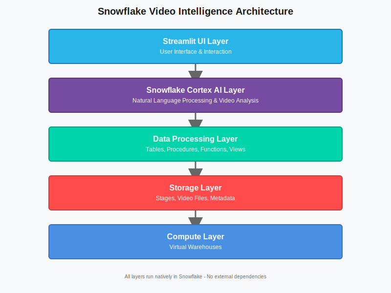

# Diagrams Documentation

All charts and architecture diagrams in this project are now **SVG markup files** for better quality, scalability, and compatibility.

## 📊 Available Diagrams

### 1. Architecture Diagram
**File**: `diagrams/architecture.svg`

**Shows**: Complete 5-layer system architecture
- Streamlit UI Layer
- Snowflake Cortex AI Layer
- Data Processing Layer
- Storage Layer
- Compute Layer

**Used in**: README.md, INSTALLATION_GUIDE.md

---

### 2. Deployment Architecture
**File**: `diagrams/deployment-architecture.svg`

**Shows**: Production deployment structure
- User access flow (HTTPS)
- Snowflake Snowsight UI
- Database components (VIDEO_INTELLIGENCE_DB)
- Virtual Warehouse (VIDEO_ANALYSIS_WH)
- Security features

**Used in**: DEPLOYMENT_GUIDE.md

---

### 3. Workflow Diagram
**File**: `diagrams/workflow.svg`

**Shows**: End-to-end video analysis workflow
1. Upload Video
2. Store in Stage
3. Register Metadata
4. Ask Question
5. Analyze with AI
6. Get Answer
7. Analytics feedback loop

**Used in**: README.md, QUICK_START.md

---

### 4. System Components
**File**: `diagrams/system-components.svg`

**Shows**: Detailed component breakdown
- All system layers with components
- Tables (VIDEO_METADATA, VIDEO_ANALYSIS_RESULTS, VIDEO_QUERIES)
- Stored Procedures (REGISTER_VIDEO, LOG_VIDEO_QUERY, etc.)
- Views (VIDEO_SUMMARY)
- Component interactions

**Used in**: PROJECT_SUMMARY.md

---

### 5. Project Structure
**File**: `diagrams/project-structure.svg`

**Shows**: Repository file and folder organization
- Documentation files
- Setup scripts
- Streamlit application
- Examples directory
- All key project files

**Used in**: README.md, PROJECT_SUMMARY.md

---

## 🎨 SVG Benefits

### Scalability
- Vector graphics scale perfectly at any size
- No pixelation or quality loss
- Responsive on all devices

### File Size
- Small file sizes (~4-7 KB each)
- Total diagrams: ~30 KB
- Much smaller than raster images

### Editability
- Text-based XML format
- Easy to edit in code or design tools
- Version control friendly

### Compatibility
- ✅ GitHub/GitLab markdown rendering
- ✅ VS Code preview
- ✅ All modern browsers
- ✅ Documentation generators
- ✅ Export to PNG/PDF if needed

### Professional Quality
- Clean, consistent styling
- Snowflake brand colors
- Readable fonts
- Clear visual hierarchy

---

## 🎨 Color Scheme

All diagrams use Snowflake's color palette:

| Color | Hex Code | Usage |
|-------|----------|-------|
| **Primary Blue** | `#29B5E8` | Streamlit UI, primary elements |
| **Purple** | `#764ba2` | Cortex AI, secondary elements |
| **Green** | `#00D4AA` | Data processing, success states |
| **Red** | `#FF4B4B` | Storage, important highlights |
| **Navy** | `#4A90E2` | Compute, infrastructure |
| **Gray** | `#666666` | Arrows, connectors |

---

## 📝 Usage in Documentation

### Markdown
```markdown

```

### HTML (with sizing)
```html

```

### With Caption
```markdown

*Figure 1: Complete system architecture showing all five layers*
```

---

## ✏️ Editing Diagrams

### Recommended Tools

**Free:**
- [Inkscape](https://inkscape.org/) - Professional open-source editor
- [Vectr](https://vectr.com/) - Web-based vector editor
- [Boxy SVG](https://boxy-svg.com/) - Online SVG editor

**Commercial:**
- Adobe Illustrator - Industry standard
- Figma - Modern design tool
- Sketch - macOS design tool

### Direct XML Editing
SVG files are XML, so you can edit them in any text editor:

```xml
<!-- Change text -->
<text x="400" y="90" fill="white">Your New Text</text>

<!-- Change color -->
<rect fill="#29B5E8" stroke="#1a75bb" />

<!-- Change size -->
<svg viewBox="0 0 800 600" width="800" height="600">
```

---

## 🔄 Converting SVG to Other Formats

### To PNG (high resolution)
```bash
# Using Inkscape
inkscape diagram.svg --export-type=png --export-dpi=300 -o diagram.png

# Using ImageMagick
convert -density 300 diagram.svg diagram.png
```

### To PDF
```bash
# Using Inkscape
inkscape diagram.svg --export-type=pdf -o diagram.pdf

# Using Chrome headless
google-chrome --headless --print-to-pdf=diagram.pdf diagram.svg
```

### To JPG
```bash
# Using ImageMagick
convert -density 300 diagram.svg -quality 90 diagram.jpg
```

---

## 🔍 Diagram Details

### Technical Specifications

| Diagram | Dimensions | File Size | Complexity |
|---------|------------|-----------|------------|
| architecture.svg | 800×600 | ~4 KB | Simple |
| deployment-architecture.svg | 700×600 | ~5 KB | Medium |
| workflow.svg | 900×250 | ~6 KB | Medium |
| system-components.svg | 850×650 | ~7 KB | Complex |
| project-structure.svg | 600×500 | ~5 KB | Medium |

### Accessibility
All diagrams include:
- ✅ Descriptive text labels
- ✅ High contrast colors (WCAG 2.1 AA compliant)
- ✅ Readable font sizes (10pt minimum)
- ✅ Semantic grouping
- ✅ Alt text support in markdown

---

## 📚 Additional Resources

- **Diagram Directory**: `/diagrams/`
- **Diagram README**: `diagrams/README.md`
- **Diagram Index**: `diagrams/diagrams-index.md`
- **Main Documentation**: `README.md`

---

## 🔧 Customization Guide

### Brand Colors
To customize for your organization, update the color values:

1. Open SVG file in text editor
2. Find color attributes: `fill="#29B5E8"`
3. Replace with your brand colors
4. Save and preview

### Text Content
Update text elements directly:

```xml
<text x="400" y="90">Your Custom Text</text>
```

### Logo Addition
Add your logo as an embedded image:

```xml
<image href="data:image/svg+xml;base64,..." x="10" y="10" width="100" height="50"/>
```

Or reference external image:

```xml
<image href="logo.png" x="10" y="10" width="100" height="50"/>
```

---

## ✅ Quality Checklist

When creating or editing diagrams:

- [ ] Use Snowflake brand colors
- [ ] Include descriptive labels
- [ ] Maintain consistent font (Arial/sans-serif)
- [ ] Ensure high contrast (WCAG AA)
- [ ] Test in markdown preview
- [ ] Optimize file size (< 10 KB)
- [ ] Include in documentation
- [ ] Update this README

---

## 🆘 Troubleshooting

### Diagram Not Rendering in GitHub
- Ensure file path is correct
- Check file encoding (must be UTF-8)
- Verify SVG syntax is valid
- Try clearing browser cache

### Diagram Too Large
- Reduce precision in numbers
- Remove unnecessary elements
- Use `viewBox` for responsive scaling
- Compress with SVGO tool

### Fonts Not Displaying Correctly
- Use web-safe fonts (Arial, sans-serif)
- Avoid custom fonts
- Embed fonts if needed
- Test across browsers

---

## 📊 Diagram Maintenance

### Update Frequency
- **Architecture changes**: Update immediately
- **Minor tweaks**: As needed
- **Color scheme**: Only with rebrand
- **Review**: Quarterly

### Version Control
All diagrams are tracked in git:
- Clear commit messages
- Describe visual changes
- Link to related documentation updates

---

**All diagrams are production-ready and optimized for documentation! 🎨**

For questions or suggestions, see [CONTRIBUTING.md](CONTRIBUTING.md).

