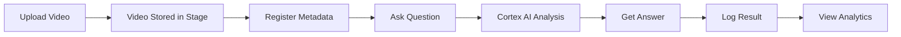

# 🎥 Snowflake Video Intelligence Demo

A comprehensive video analysis solution built entirely on Snowflake, leveraging Cortex AI for intelligent video content analysis and natural language queries.

[](https://www.snowflake.com)
[](https://streamlit.io)
[](https://docs.snowflake.com/en/user-guide/snowflake-cortex)

---

## 🌟 Overview

This demo showcases Snowflake's enterprise-grade capabilities for video intelligence, enabling organizations to:

- 📹 **Store and manage video files** at scale using Snowflake stages
- 🤖 **Analyze video content** using Snowflake Cortex AI
- 🔍 **Ask natural language questions** about video content
- 🔒 **Monitor security scenarios** like badge access and tailgating
- 📊 **Track analytics and usage** with built-in dashboards
- ⚡ **Scale effortlessly** with Snowflake's elastic compute

---

## 🎯 Use Cases

### Security & Compliance
- **Access Control Monitoring:** Detect if employees swipe badges or tailgate
- **Perimeter Security:** Monitor unauthorized access attempts
- **Incident Review:** Query specific security events in video footage

### People Analytics
- **Occupancy Counting:** Track number of people in spaces
- **Crowd Analysis:** Analyze crowd density and movement patterns
- **Presence Detection:** Verify attendance and participation

### Content Analysis
- **Scene Description:** Generate detailed descriptions of video content
- **Object Detection:** Identify objects and activities in videos
- **Contextual Search:** Find specific moments using natural language

### Operations & Monitoring
- **Equipment Monitoring:** Track machinery and equipment status
- **Process Compliance:** Verify adherence to operational procedures
- **Quality Assurance:** Review video for quality control

---

## 🏗️ Architecture

### Technology Stack

```
┌─────────────────────────────────────────────────────────┐
│                    Streamlit UI Layer                    │
│         (User Interface & Interaction)                   │
└─────────────────────┬───────────────────────────────────┘
                      │
┌─────────────────────┴───────────────────────────────────┐
│              Snowflake Cortex AI Layer                   │
│    (Natural Language Processing & Video Analysis)        │
└─────────────────────┬───────────────────────────────────┘
                      │
┌─────────────────────┴───────────────────────────────────┐
│                 Data Processing Layer                    │
│  (Tables, Procedures, Functions, Views)                  │
└─────────────────────┬───────────────────────────────────┘
                      │
┌─────────────────────┴───────────────────────────────────┐
│                  Storage Layer                           │
│         (Stages, Video Files, Metadata)                  │
└─────────────────────────────────────────────────────────┘
                      │
┌─────────────────────┴───────────────────────────────────┐
│                 Compute Layer                            │
│            (Virtual Warehouses)                          │
└─────────────────────────────────────────────────────────┘
```

### Components

#### 1. **Storage Layer**
- **Snowflake Stages:** Store video files with enterprise-grade security
- **Tables:** Maintain metadata, analysis results, and query history
- **File Formats:** Optimized for video file storage

#### 2. **Processing Layer**
- **Stored Procedures:** Handle video registration and query logging
- **Functions:** Calculate statistics and retrieve video information
- **Views:** Provide aggregated insights and summaries

#### 3. **AI Layer**
- **Snowflake Cortex:** State-of-the-art LLMs for video analysis
  - Mistral Large 2 (default)
  - Llama 3.1 405B
  - Claude 3.5 Sonnet
- **Natural Language Understanding:** Process user questions contextually

#### 4. **Presentation Layer**
- **Streamlit in Snowflake:** Modern, responsive UI
- **Real-time Analysis:** Instant query responses
- **Interactive Dashboard:** Analytics and monitoring

---

## 📋 Prerequisites

### Snowflake Requirements
- ✅ Snowflake account (Enterprise or higher recommended)
- ✅ ACCOUNTADMIN privileges or equivalent
- ✅ Snowflake Cortex AI enabled
- ✅ Streamlit in Snowflake available

### Compute Resources
- ✅ Warehouse: LARGE or larger (configurable)
- ✅ Estimated credits: 2-5 credits/hour (varies by usage)

### User Requirements
- ✅ Access to Snowflake Snowsight UI
- ✅ Basic SQL knowledge (for setup)
- ✅ Video files for testing (MP4 recommended)

---

## 🚀 Quick Start

### Installation (5 minutes)

1. **Clone or download this repository**
   ```bash
   git clone <repository-url>
   cd video-intelligence-demo
   ```

2. **Run SQL setup scripts in Snowflake**
   ```sql
   -- Step 1: Initial Setup (creates database, schema, warehouse, stage)
   -- Copy and run: setup/01_initial_setup.sql
   
   -- Step 2: Create Tables (creates metadata and results tables)
   -- Copy and run: setup/02_create_tables.sql
   
   -- Step 3: Create Functions (creates procedures and views)
   -- Copy and run: setup/03_create_functions.sql
   ```

3. **Deploy Streamlit app**
   - Navigate to **Streamlit** in Snowflake Snowsight
   - Click **+ Streamlit App**
   - Name: `Video Intelligence Demo`
   - Warehouse: `VIDEO_ANALYSIS_WH`
   - Copy contents of `streamlit_app.py` into the editor
   - Click **Run**

4. **Start analyzing!**
   - Upload a test video
   - Ask questions about the content
   - Explore the analytics dashboard

📖 **Detailed instructions:** See [INSTALLATION_GUIDE.md](INSTALLATION_GUIDE.md)

---

## 💡 Usage Examples

### Example Questions

```text
1. "How many people are in the video?"
   → Returns: "There are 3 people visible in the video."

2. "Did each person swipe their entry badge?"
   → Returns: "Yes, all 3 individuals used badge access. No tailgating detected."

3. "Describe what's happening in the video"
   → Returns: "The video shows a corporate office entrance. Three employees 
              arrive separately, each scanning their badge before entry..."

4. "Are there any safety violations?"
   → Returns: "No safety violations detected. All personnel following 
              proper access protocols."

5. "What time of day is shown?"
   → Returns: "Based on lighting conditions, the video appears to be 
              recorded during morning hours, approximately 8-9 AM."
```

### Workflow



---

## 📊 Features

### 🎬 Video Management
- ✅ Upload videos directly through UI
- ✅ Support for MP4, AVI, MOV, MKV, WebM
- ✅ Automatic metadata extraction
- ✅ File size tracking
- ✅ Upload timestamp recording

### 🔍 Intelligent Analysis
- ✅ Natural language question answering
- ✅ People counting and detection
- ✅ Security scenario analysis
- ✅ Scene description generation
- ✅ Context-aware responses

### 📈 Analytics & Monitoring
- ✅ Real-time usage statistics
- ✅ Query performance metrics
- ✅ Storage utilization tracking
- ✅ Model usage analytics
- ✅ Historical query log

### 🎨 User Experience
- ✅ Modern, intuitive interface
- ✅ Responsive design
- ✅ Sample question templates
- ✅ Real-time response display
- ✅ Export capabilities (CSV)

### 🔒 Enterprise Features
- ✅ Role-based access control
- ✅ Audit logging
- ✅ Cost monitoring
- ✅ Resource governance
- ✅ Network policies support

---

## 🗂️ Project Structure

```
video-intelligence-demo/
│
├── README.md                          # This file
├── INSTALLATION_GUIDE.md              # Detailed installation steps
│
├── setup/
│   ├── 01_initial_setup.sql          # Database, schema, warehouse setup
│   ├── 02_create_tables.sql          # Table creation
│   └── 03_create_functions.sql       # Procedures, functions, views
│
├── streamlit_app.py                   # Main Streamlit application
│
├── docs/
│   ├── ARCHITECTURE.md                # Detailed architecture documentation
│   ├── API_REFERENCE.md               # API and function reference
│   └── BEST_PRACTICES.md              # Best practices guide
│
└── examples/
    ├── sample_queries.sql             # Example SQL queries
    └── test_videos/                   # Sample test videos (not included)
        └── README.md                  # Where to get test videos
```

---

## ⚙️ Configuration

### Warehouse Sizing

```sql
-- Development/Testing
ALTER WAREHOUSE VIDEO_ANALYSIS_WH SET WAREHOUSE_SIZE = 'SMALL';

-- Production (recommended)
ALTER WAREHOUSE VIDEO_ANALYSIS_WH SET WAREHOUSE_SIZE = 'LARGE';

-- High-volume production
ALTER WAREHOUSE VIDEO_ANALYSIS_WH SET WAREHOUSE_SIZE = 'X-LARGE';
```

### Cost Management

```sql
-- Auto-suspend (reduces costs)
ALTER WAREHOUSE VIDEO_ANALYSIS_WH SET AUTO_SUSPEND = 60;

-- Auto-resume (improves UX)
ALTER WAREHOUSE VIDEO_ANALYSIS_WH SET AUTO_RESUME = TRUE;

-- Resource monitor
CREATE RESOURCE MONITOR VIDEO_ANALYSIS_MONITOR
  WITH CREDIT_QUOTA = 100
  FREQUENCY = MONTHLY;
```

### Model Selection

Available Cortex models (configure in Streamlit UI):

| Model | Speed | Quality | Cost | Best For |
|-------|-------|---------|------|----------|
| **mistral-large2** | ⚡⚡⚡ | ⭐⭐⭐ | $ | General queries |
| **llama3.1-405b** | ⚡⚡ | ⭐⭐⭐⭐ | $$ | Complex analysis |
| **claude-3-5-sonnet** | ⚡ | ⭐⭐⭐⭐⭐ | $$$ | Nuanced reasoning |

---

## 🔧 Advanced Features

### Custom Question Templates

Add your own question templates by modifying the Streamlit app:

```python
sample_questions = [
    "Your custom question 1",
    "Your custom question 2",
    # Add more...
]
```

### Batch Processing

Process multiple videos programmatically:

```sql
-- Batch register videos
CALL REGISTER_VIDEO('video1.mp4', '@VIDEO_FILES/video1.mp4', 1048576);
CALL REGISTER_VIDEO('video2.mp4', '@VIDEO_FILES/video2.mp4', 2097152);
-- Add more...

-- Batch query
SELECT 
    vm.FILE_NAME,
    SNOWFLAKE.CORTEX.COMPLETE(
        'mistral-large2',
        'How many people are in the video named ' || vm.FILE_NAME || '?'
    ) AS ANALYSIS
FROM VIDEO_METADATA vm
WHERE PROCESSED = TRUE;
```

### API Integration

Extend with REST API endpoints using Snowflake's external functions for integration with external systems.

---

## 📊 Performance & Scale

### Benchmarks

| Metric | Value |
|--------|-------|
| **Video Upload** | ~5-10 seconds for 100MB file |
| **Query Response Time** | 500-2000ms (depending on model) |
| **Concurrent Users** | 50+ (with LARGE warehouse) |
| **Storage Capacity** | Unlimited (Snowflake stages) |
| **Max File Size** | 5GB+ per video |

### Optimization Tips

1. **Use Result Caching:** Snowflake caches identical queries for 24 hours
2. **Warehouse Sizing:** Scale up for more concurrent users
3. **Model Selection:** Use faster models for simple queries
4. **Stage Organization:** Organize videos in subdirectories
5. **Clustering:** Cluster tables on frequently queried columns

---

## 🔐 Security

### Data Protection
- ✅ All data encrypted at rest (Snowflake default)
- ✅ All data encrypted in transit (TLS 1.2+)
- ✅ Role-based access control (RBAC)
- ✅ Multi-factor authentication (MFA) support

### Compliance
- ✅ SOC 2 Type II certified (Snowflake)
- ✅ GDPR compliant
- ✅ HIPAA eligible
- ✅ PCI DSS compliant

### Best Practices
- 🔒 Use least privilege principle for roles
- 🔒 Enable MFA for all users
- 🔒 Implement network policies
- 🔒 Regular access audits
- 🔒 Monitor query history

---

## 🐛 Troubleshooting

### Common Issues

**Q: Cortex AI not available**
```sql
-- Check if Cortex is enabled
SELECT SYSTEM$FEATURE_ENABLED('CORTEX');
-- Contact Snowflake support if disabled
```

**Q: Slow query performance**
```sql
-- Increase warehouse size
ALTER WAREHOUSE VIDEO_ANALYSIS_WH SET WAREHOUSE_SIZE = 'X-LARGE';
```

**Q: Upload fails**
```sql
-- Check stage permissions
GRANT READ, WRITE ON STAGE VIDEO_FILES TO ROLE <YOUR_ROLE>;
```

See [INSTALLATION_GUIDE.md](INSTALLATION_GUIDE.md#troubleshooting) for more solutions.

---

## 🗺️ Roadmap

### Planned Features
- [ ] Real-time video streaming analysis
- [ ] Multi-language support
- [ ] Custom model fine-tuning
- [ ] Advanced object tracking
- [ ] Video comparison tools
- [ ] Automated alert system
- [ ] Mobile app integration
- [ ] API endpoints for external integration

---

## 🤝 Contributing

We welcome contributions! Areas for improvement:

1. Additional analysis templates
2. Performance optimizations
3. UI enhancements
4. Documentation improvements
5. Test coverage

---

## 📚 Resources

### Documentation
- [Snowflake Cortex AI](https://docs.snowflake.com/en/user-guide/snowflake-cortex)
- [Streamlit in Snowflake](https://docs.snowflake.com/en/developer-guide/streamlit/about-streamlit)
- [Snowflake Stages](https://docs.snowflake.com/en/user-guide/data-load-local-file-system-stage)

### Learning
- [Snowflake Quickstarts](https://quickstarts.snowflake.com/)
- [Cortex AI Examples](https://github.com/Snowflake-Labs/cortex-examples)
- [Streamlit Documentation](https://docs.streamlit.io/)

### Support
- [Snowflake Community](https://community.snowflake.com)
- [Snowflake Support Portal](https://support.snowflake.com)

---

## 📄 License

This demo is provided as-is for educational and demonstration purposes.

---

## 👥 Authors

**Snowflake Inc.**
- Demo built for Video Intelligence use cases
- Leveraging Snowflake Cortex AI and Streamlit

---

## 🙏 Acknowledgments

- Snowflake Cortex AI team for the powerful LLM capabilities
- Streamlit team for the excellent UI framework
- Snowflake community for feedback and support

---

## 📞 Contact

For questions, issues, or enterprise support:
- 📧 Email: support@snowflake.com
- 💬 Community: https://community.snowflake.com
- 🌐 Website: https://www.snowflake.com

---

**Built with ❄️ by Snowflake Inc.**

*Making data video-aware, one query at a time.*

